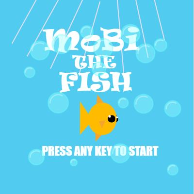
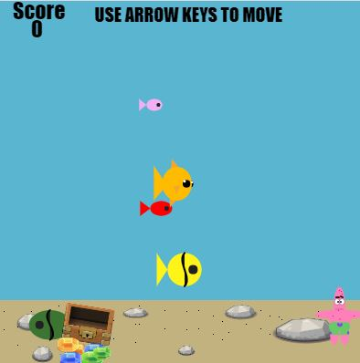
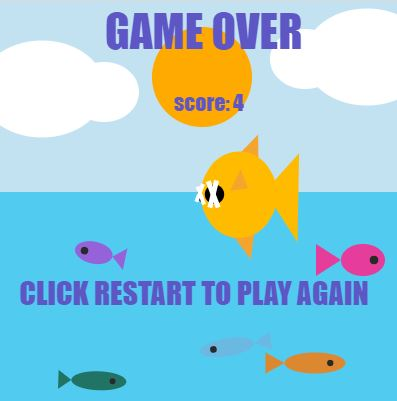

# Mobi The Fish
Mobi The Fish game, a game in which the objective is to use mobi the fish to swim across the sea and eat other fish!

## Description
  * The objective of this game is to use your fish (MoBi) and swim across the sea and eat smaller fish
  * As you eat these fish you will gain points and your fish will become bigger.
  * If you get eaten by a bigger fish the game will end.
  * However as your score increases, the fishes speed will also increase making it harder to dodge the fish.
  * The game consists of 4 screens Starting Screen, Playing Screen, Game Over Screen , Winning screen

## Screenshots 

 
 
 

